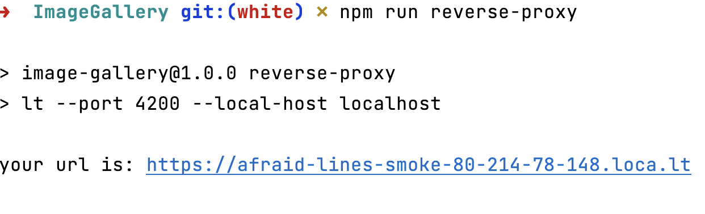

# Fieldwire - Image Gallery

This single page Web app to **display** and **search** and **view** images that are hosted in _imgur_.

This project is an Angular application. 
Please take a look on the technical environment specification below. 

# Requirements
- Node
- Docker
- ANgular CLI

# Run
### 1. Run the local server
There are two options to run the application on local server (localhost).

#### manual run 

```sh
$ npm install 

$ npm start
```

#### docker 

- Install the docker engine on your machine (depending on your machine's OS). Installation details => https://docs.docker.com/engine/install/
- Run the start.sh script located at the root of the project
```sh
$ ./start.sh (or sh start.sh)
```

### 2. Run the reverse proxy
Whatever option you choose, you might encounter CORS issues (with error code 429) due to your code running on localhost. 
You can bypass this issue by using a reverse proxy such as **ngrok** (paying service otherwise limited request number) or **localtunnel** (free service).

In this project, the choice has been made on **localtunnel** because it is simply free.

If the application is started manually, you need to run the following command line _in a different terminal tab or window_ to run the reverse proxy and generate a new public front URL.
```sh
npm run reverse-proxy
```
Click on the generated link and follow the instructions



This step is executed automatically when you run the application with docker and the URL is displayed once the image is up

> **_NOTE:_** 
> you can choose to use **ngrok** instead of localtunnel. 
> For that, you need to install ngrok first : [installation guide](https://ngrok.com/docs/getting-started#step-2-install-the-ngrok-agent)
> Then run the following command line :
> ```sh
> ngrok http --host-header=rewrite <port>
> ```


# Technical Environment Specification
- Docker Engine
- Angular CLI: 15.0.2
- Node: 18.12.1
- Npm 8.19.2

- Angular: 15.0.2
  - animations, cli, common, compiler, compiler-cli, core, forms
  - language-service, platform-browser, platform-browser-dynamic

### Packages Version

- @angular-devkit/architect       0.1500.2
- @angular-devkit/build-angular   15.0.2
- @angular-devkit/core            15.0.2
- @angular-devkit/schematics      15.0.2
- @angular/material               15.0.1
- @schematics/angular             15.0.2
- rxjs                            7.5.7
- typescript                      4.8.4

# UX 
- Angular Material : @angular/material (15.0.1)
- Bootstrap 4
